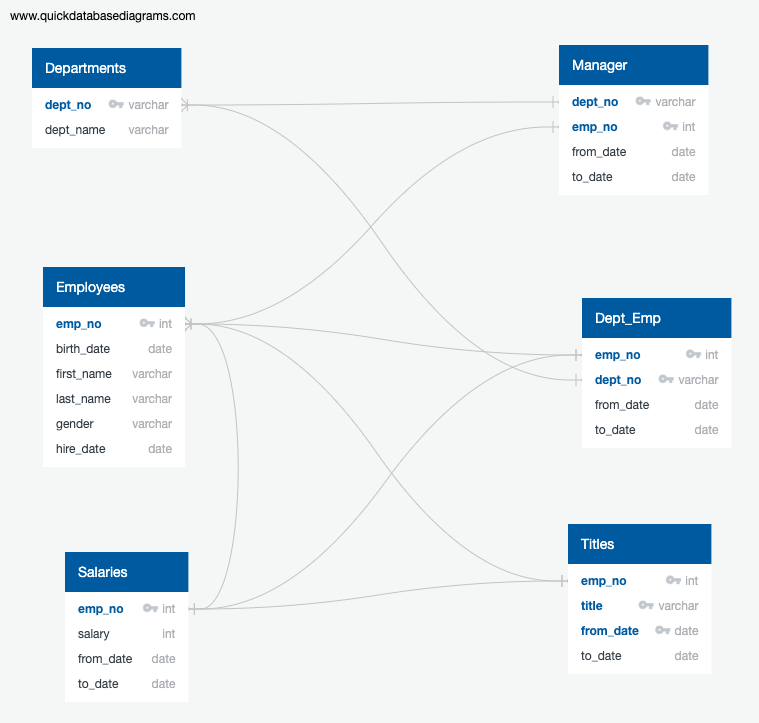

# Pewlett_Hackard_Analysis
Module 7 Challenge

# Preparing for The Silver Tsunami
## Feeling the Shake

Much like before a tsunami hits there are usually signs. In the modern age there is about to be a huge shift in the work force. This leaves companies who are unprepared at a huge disadvantage. To safe guard against this analyzing our data will tell us what positions need to be filled and how many. 

# Understanding Current Data
## Analyzing Crucial Week Points

- The above ERD shows the different tables and their relations. To get information like who is retiring and from where you need to join multiple tables. 

- To accomplish the total count of employees retiring by title the employees and titles tables were joined. The relevant information was there to set filters and apply conditions to inform of us the number of unique titles retiring in the coming years.

## Preparing Defenses and Relief

- With this new information the company decides to set a mentor ship program in place. This will allow the company to retain viral information and ensure a smooth transition. 

- With the creation of databases our company learned vital information. The company then stored this information and set in place action plans based on the data. 

## Summary
# Action Plans

- A total of 90,398 jobs will need to be replaced in the next few years as the Silver Tsunami hits. 

- There are not enough employees eligible for the mentorship program. In comparison there are only 1,549 mentors that would be available to mentor the next generation.